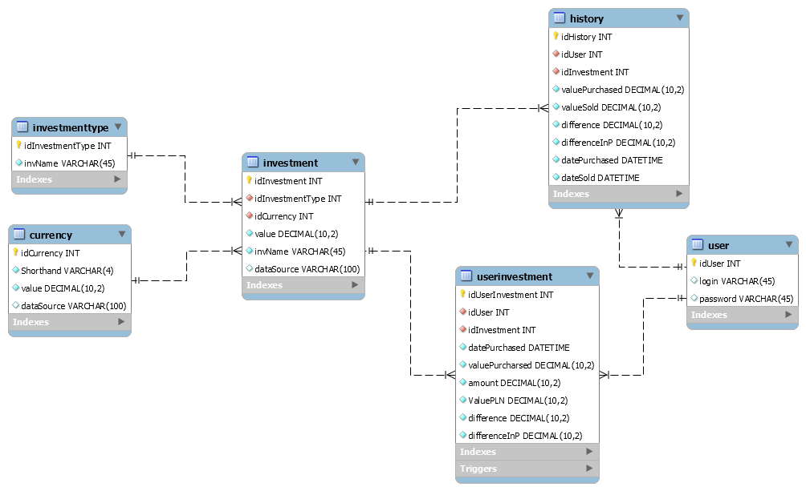
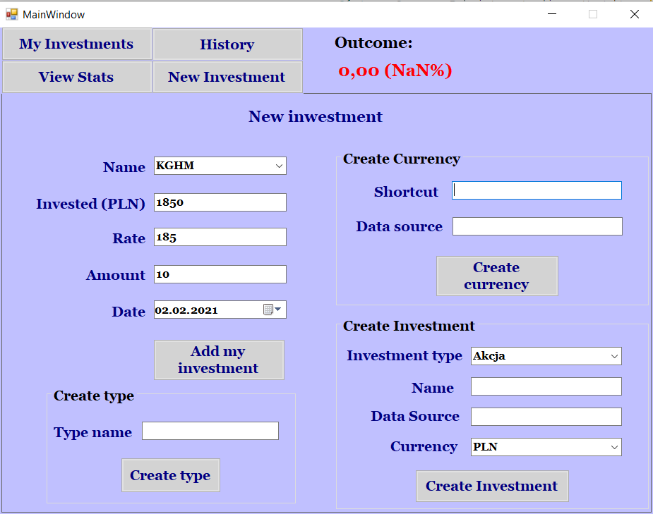
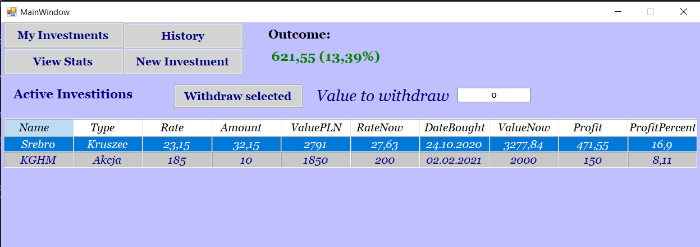

# InvestmentView
 Simple app which helps in managing your investitions (trading) - viewing current profit, history of investitions, total sum of earned/lost money and more.
 
# General info
In todays world investing in precious metals and stock become very popular. This project was created to help my friend in managing his investitions in simple way. Application helps with all math work needed in caluclating current profit (e.g cheks currency rates, actual investments rates and calulates them including info about user's amount of current stock). Project also shows various stats about user's inwestment pocket.

# Technologies 
Project was created in usage of Windows Forms
* C# 9.0
* MySQL 8.0.19
* Dapper 2.0.78

# Setup
To build this aplication you will need to install MySQL Server and Visual Studio. Wchile instaling MySQL Server set username as "InvestmentProject" and password: InvestmentProject. After that you will have to run Database.sql and trigger.sql file. This should set up local database which will work with Applikaction built using Visual Studio (install Dapper first by managing NuGet packages). 

# Status
Projects is finished, but I possibly will add some new fetures in future.

# Images
 ## EER diagram for database
 

 ## Creating new Investment 
 

 ## View of current investments
 
